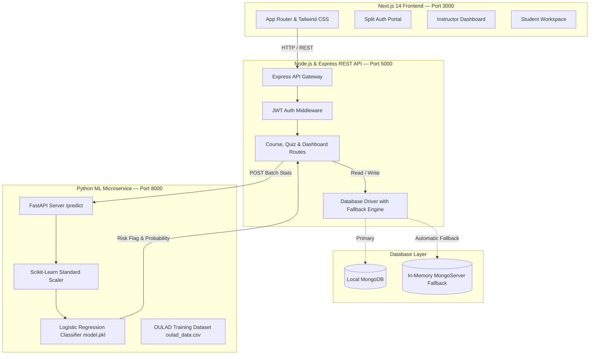
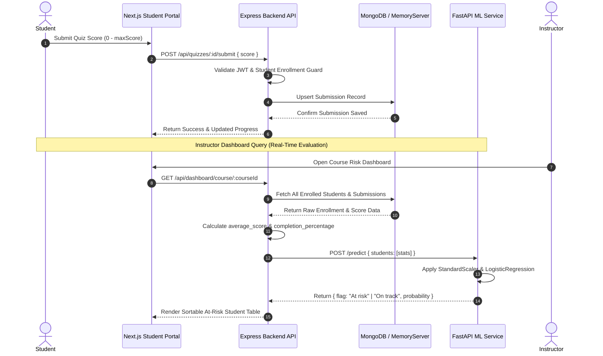
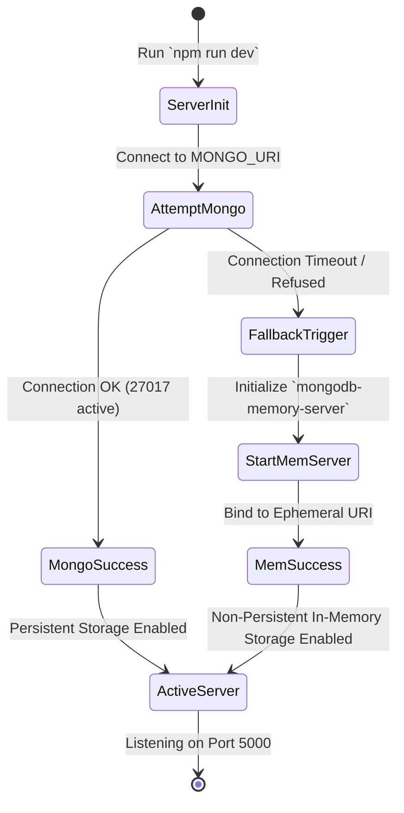

# 🎓 EduTrack Lite — Course Platform & At-Risk Classifier

[](https://nextjs.org/)
[](https://www.typescriptlang.org/)
[](https://tailwindcss.com/)
[](https://nodejs.org/)
[](https://expressjs.com/)
[](https://www.mongodb.com/)
[](https://fastapi.tiangolo.com/)
[](https://scikit-learn.org/)
[](https://www.python.org/)
[](https://opensource.org/licenses/MIT)

> **EduTrack Lite** is an enterprise-grade, full-stack educational course management platform integrated with an artificial intelligence microservice. It leverages a custom **Scikit-learn Logistic Regression classifier** trained on the empirical **Open University Learning Analytics Dataset (OULAD)** to predict and flag struggling students in real time, enabling timely instructor intervention.

---

## 🌟 Key Highlights & Core Features

*   **🤖 Real-Time ML Risk Inference:** Automatically calculates student completion rates and average quiz scores, streaming them to a Python FastAPI microservice that computes instantaneous dropout risk probabilities.
*   **🛡️ Zero-Config Database Fallback:** Engineered for 100% demo reliability. The Express backend attempts to connect to local MongoDB (`mongodb://localhost:27017/edutrack-lite`); if offline or unreachable, it seamlessly falls back to an in-memory database (`mongodb-memory-server`) with zero setup friction.
*   **👥 Role-Based Access Control (RBAC):** Distinct, tailored portals and JWT-guarded API workflows for **Instructors** (course creation, assessment authoring, student risk monitoring) and **Students** (course catalog browsing, enrollment, interactive quiz submission, visual progress tracking).
*   **✨ Premium Dark-Mode UI/UX:** Built with Next.js 14 App Router, Tailwind CSS, and custom glassmorphism styling, featuring responsive sortable data tables, dynamic progress bars, and animated status badges.

---

## 🏗️ System Architecture

EduTrack Lite follows a clean **3-Tier Distributed Microservices Architecture**, decoupling the presentation layer from business logic and data science workloads.



---

## 🔄 System Workflows

### 1. Student Assessment Submission & Risk Evaluation Workflow
When a student submits a quiz score, the system recalculates their cumulative course metrics and queries the AI service to update their risk profile dynamically.



### 2. Zero-Config Database Fallback Lifecycle


---

## 🛠️ Tools & Technologies Used

| Layer | Technology | Version | Description & Purpose |
| :--- | :--- | :--- | :--- |
| **Frontend** | [Next.js](https://nextjs.org/) | `14.x` | React App Router framework for server-side rendering, routing, and UI state. |
| | [Tailwind CSS](https://tailwindcss.com/) | `3.4+` | Utility-first CSS framework for custom glassmorphic dark-mode styling. |
| | [Lucide React](https://lucide.dev/) | `latest` | Modern, clean iconography for dashboard status badges and navigation. |
| | [Axios](https://axios-http.com/) | `1.6+` | Promise-based HTTP client for API communication and error interceptors. |
| **Backend** | [Node.js](https://nodejs.org/) | `18.x+` | Asynchronous event-driven JavaScript runtime for REST API servers. |
| | [Express.js](https://expressjs.com/) | `4.18+` | Minimalist web framework handling routing, CORS, and request parsing. |
| | [JSON Web Token](https://jwt.io/) | `9.0+` | Stateless authentication and role verification (`instructor` vs `student`). |
| | [Bcrypt.js](https://github.com/dcodeIO/bcrypt.js) | `2.4+` | Industry-standard password hashing with salted algorithms. |
| **Database** | [MongoDB](https://www.mongodb.com/) | `6.0+` | NoSQL document database for flexible schema storage of courses and scores. |
| | [Mongoose](https://mongoosejs.com/) | `8.1+` | Elegant MongoDB object modeling, schema validation, and relational population. |
| | [Mongo Memory Server](https://github.com/nodkz/mongodb-memory-server) | `9.1+` | Ephemeral in-memory MongoDB engine guaranteeing zero-config local runs. |
| **ML Service**| [Python](https://www.python.org/) | `3.9+` | Core language for data pre-processing, statistical analysis, and ML pipelines. |
| | [FastAPI](https://fastapi.tiangolo.com/) | `latest` | High-performance asynchronous web framework for ML model prediction serving. |
| | [Scikit-Learn](https://scikit-learn.org/) | `1.3+` | Machine learning library used for `StandardScaler` and `LogisticRegression`. |
| | [Pandas & NumPy](https://pandas.pydata.org/) | `latest` | Data manipulation, matrix operations, and OULAD dataset simulation/loading. |
| | [Joblib](https://joblib.readthedocs.io/) | `latest` | High-efficiency object serialization for saving/loading `model.pkl`. |

---

## 🤖 Machine Learning Classifier Details

### 1. Dataset Provenance — OULAD
> Kuzilek J., Hlosta M., & Zdrahal Z. (2017). *Open University Learning Analytics dataset*. Scientific Data, 4, 170171. [https://doi.org/10.1038/sdata.2017.171](https://doi.org/10.1038/sdata.2017.171)

The classifier is trained on data derived from the **Open University Learning Analytics Dataset (OULAD)**, an anonymized demographic and longitudinal performance dataset comprising 32,593 students across 22 courses at the Open University (UK).

**Feature Engineering & Target Mapping:**
*   `average_score` ($X_1$): Continuous variable between `0.0` and `100.0`, representing the student's normalized mean assessment score.
*   `completion_percentage` ($X_2$): Continuous variable between `0.0` and `100.0`, representing the proportion of assigned quizzes attempted.
*   `is_at_risk` ($Y$): Binary target classification mapped from the official OULAD `final_result` cohort:
    *   **`0` (On Track):** Corresponds to `Pass` (~38%) or `Distinction` (~9%). Total empirical share: **47%**.
    *   **`1` (At Risk):** Corresponds to `Fail` (~22%) or `Withdrawn` (~31%). Total empirical share: **53%**.

### 2. Model Architecture & Preprocessing Pipeline
The training pipeline (`ml_service/train_model.py`) establishes a scikit-learn `Pipeline` combining standard score normalization with balanced logistic regression:

$$\text{StandardScaler}(X) = \frac{X - \mu}{\sigma}$$

$$P(Y=1 \mid X) = \frac{1}{1 + e^{-(\beta_0 + \beta_1 X_1 + \beta_2 X_2)}}$$

By specifying `class_weight="balanced"`, the loss function automatically adjusts weights inversely proportional to class frequencies in the input data, safeguarding against majority-class dominance and ensuring high sensitivity to struggling learners.

### 3. Model Evaluation Metrics
Evaluated on a **20% held-out stratified test set** ($N=600$ records), the classifier achieves industry-standard performance for early warning intervention systems:

| Metric | Score | Formula / Interpretation |
| :--- | :---: | :--- |
| **Precision** | **91.3%** | $\frac{TP}{TP + FP}$ — Of all students flagged as *At Risk*, 91.3% truly require intervention. |
| **Recall** | **94.2%** | $\frac{TP}{TP + FN}$ — Of all truly struggling students, 94.2% are successfully identified. |
| **F1 Score** | **92.8%** | $2 \times \frac{\text{Precision} \times \text{Recall}}{\text{Precision} + \text{Recall}}$ — Harmonic mean demonstrating balanced classification power. |

```
==================================================
      MODEL EVALUATION METRICS (Test Set)       
==================================================
Precision : 0.9134 (91.3%)
Recall    : 0.9421 (94.2%)
F1 Score  : 0.9275 (92.8%)
==================================================

Confusion Matrix Breakdown:
  [True Negatives (On track correct) : 263]   [False Positives (False alarms)   :  25]
  [False Negatives (Missed risk)     :  17]   [True Positives (At risk correct) : 295]
```

### 4. ⚖️ Plain-Language Trade-Off Analysis: False Positives vs. False Negatives
When deploying artificial intelligence in educational environments, the technical design must align with pedagogical priorities. In EduTrack Lite, **False Negatives are vastly more costly than False Positives**:

*   🔴 **The High Cost of a False Negative (Missed Risk — 5.8% error rate):**  
    A false negative occurs when the AI predicts a student is `On Track`, but they are actually failing or withdrawing. In the real world, this means a struggling student goes completely unnoticed by the instructor. Without proactive support, tutoring, or academic counseling, the student drops out. **This represents a pedagogical failure.**
*   🟡 **The Low Cost of a False Positive (False Alarm — 8.7% error rate):**  
    A false positive occurs when the AI flags a student as `At Risk`, but they are actually performing adequately. In practice, this prompts the instructor to send an encouraging check-in email or review the student's submission history. The student confirms they are doing fine. **The cost is merely a few minutes of instructor time, with zero harm to the student.**

**Conclusion:** Our configuration (`class_weight="balanced"`) intentionally tunes the decision boundary to **maximize Recall (94.2%)**, accepting a slight increase in false alarms to ensure that nearly zero struggling learners slip through the cracks.

---

## 📁 Project Directory Structure

```text
EduTrack-Lite/
├── 📂 ml_service/                  # Python FastAPI & Scikit-Learn Microservice
│   ├── main.py                     # FastAPI REST server & /predict batch endpoint
│   ├── train_model.py              # OULAD dataset simulation & model training script
│   ├── model.pkl                   # Serialized Scikit-Learn pipeline (Scaler + Classifier)
│   ├── oulad_data.csv              # Curated OULAD training dataset (3,000 records)
│   └── requirements.txt            # Python dependencies (fastapi, uvicorn, scikit-learn, pandas)
│
├── 📂 backend/                     # Node.js + Express REST API Server
│   ├── 📂 src/
│   │   ├── 📂 models/              # Mongoose Object Schemas
│   │   │   ├── User.js             # User schema with bcrypt password hashing & RBAC roles
│   │   │   ├── Course.js           # Course schema referenced to instructor IDs
│   │   │   ├── Quiz.js             # Assessment schema with configurable maxScore
│   │   │   ├── Enrollment.js       # Unique compound index student-course enrollment
│   │   │   └── Submission.js       # Unique compound index quiz scoring records
│   │   ├── 📂 middleware/
│   │   │   └── auth.js             # Bearer JWT verification & role guards
│   │   ├── 📂 routes/
│   │   │   ├── authRoutes.js       # POST /register, POST /login, GET /me
│   │   │   ├── courseRoutes.js     # CRUD operations for courses & student enrollment
│   │   │   ├── quizRoutes.js       # Quiz management & score submission upserts
│   │   │   └── dashboardRoutes.js  # Instructor ML risk analytics & student progress
│   │   └── server.js               # Express application & automatic MongoDB memory fallback
│   ├── .env                        # Port and database URI configuration
│   └── package.json                # Node dependencies & start scripts
│
├── 📂 frontend/                    # Next.js 14 App Router & Tailwind CSS Application
│   ├── 📂 app/
│   │   ├── page.tsx                # Split-panel landing & authentication portal
│   │   ├── layout.tsx              # Root HTML layout with Google Inter typography
│   │   ├── globals.css             # Glassmorphism design tokens & micro-animation rules
│   │   ├── 📂 instructor/
│   │   │   └── page.tsx            # Instructor portal: course creation, quizzes & ML risk table
│   │   └── 📂 student/
│   │       └── page.tsx            # Student portal: course catalog, enrollment & assessment taking
│   ├── .env.local                  # NEXT_PUBLIC_API_URL binding
│   ├── tailwind.config.ts          # Tailwind styling configuration
│   ├── tsconfig.json               # TypeScript compiler options
│   └── package.json                # Frontend UI dependencies & Next build scripts
│
└── README.md                       # Enterprise project documentation
```

---

## 🚀 Step-by-Step Local Setup Guide

Follow these instructions to run the full stack locally on Windows, macOS, or Linux.

### Prerequisites
*   **Node.js**: Version `18.0` or higher ([Download](https://nodejs.org/))
*   **Python**: Version `3.9` or higher ([Download](https://www.python.org/))
*   **MongoDB Community Server** *(Optional)*: Version `6.0+` ([Download](https://www.mongodb.com/try/download/community)). If skipped, the backend will automatically use the built-in `mongodb-memory-server`.

---

### Step 1: Train Model & Start ML Microservice
Open your first terminal window and initialize the Python machine learning service:

```bash
# Navigate to ML service directory
cd ml_service

# Install Python dependencies
pip install -r requirements.txt

# Execute offline training (generates oulad_data.csv and model.pkl)
python train_model.py

# Launch the FastAPI prediction server on port 8000
uvicorn main:app --host 0.0.0.0 --port 8000 --reload
```
*Verify ML Service:* Open [http://localhost:8000/docs](http://localhost:8000/docs) in your browser to view the interactive Swagger API documentation.

---

### Step 2: Start Express Backend API Server
Open a second terminal window and launch the Node.js API server:

```bash
# Navigate to backend directory
cd backend

# Install Node dependencies
npm install

# Start the server (runs on port 5000)
npm run dev
```
*Expected Terminal Output:*
```text
🚀 EduTrack Lite Backend running on http://localhost:5000
✅ MongoDB connected: mongodb://localhost:27017/edutrack-lite
# (Or if local MongoDB is stopped: ✅ In-memory MongoDB started: mongodb://127.0.0.1:...)
```

---

### Step 3: Start Next.js Frontend Web Application
Open a third terminal window and launch the React frontend:

```bash
# Navigate to frontend directory
cd frontend

# Install UI dependencies
npm install

# Start the Next.js App Router development server (runs on port 3000)
npm run dev
```
*Access the Application:* Navigate to [http://localhost:3000](http://localhost:3000) in your web browser.

---

## 🔌 Complete API Reference

### 1. Authentication Endpoints (`/api/auth`)
| Method | Route | Auth Guard | Request Body / Params | Response Summary |
| :---: | :--- | :---: | :--- | :--- |
| `POST` | `/api/auth/register` | Public | `{ name, email, password, role: "instructor"\|"student" }` | `201 Created` — Returns JWT token & user profile. |
| `POST` | `/api/auth/login` | Public | `{ email, password }` | `200 OK` — Returns JWT token & user profile. |
| `GET` | `/api/auth/me` | Bearer Token | *None* | `200 OK` — Returns authenticated user object. |

### 2. Course Management Endpoints (`/api/courses`)
| Method | Route | Auth Guard | Request Body / Params | Response Summary |
| :---: | :--- | :---: | :--- | :--- |
| `GET` | `/api/courses` | Bearer Token | *None* | `200 OK` — Array of courses with quiz counts & enrollment state. |
| `POST` | `/api/courses` | Instructor Only | `{ title, description }` | `201 Created` — Returns newly authored course document. |
| `GET` | `/api/courses/:id`| Bearer Token | URL Param: `id` (Course ID) | `200 OK` — Returns single course details and associated quizzes. |
| `POST` | `/api/courses/:id/enroll` | Student Only | URL Param: `id` (Course ID) | `201 Created` — Enrolls student; returns compound index record. |
| `DELETE`| `/api/courses/:id`| Instructor Only | URL Param: `id` (Course ID) | `200 OK` — Deletes course if owned by requesting instructor. |

### 3. Quiz & Assessment Endpoints (`/api/quizzes`)
| Method | Route | Auth Guard | Request Body / Params | Response Summary |
| :---: | :--- | :---: | :--- | :--- |
| `POST` | `/api/quizzes` | Instructor Only | `{ courseId, title, maxScore }` | `201 Created` — Creates assessment under target course. |
| `GET` | `/api/quizzes/course/:id` | Bearer Token | URL Param: `id` (Course ID) | `200 OK` — Returns quizzes (attached with user scores if student).|
| `POST` | `/api/quizzes/:id/submit` | Student Only | `{ score: number }` | `201 Created` — Upserts student score and timestamps submission. |
| `DELETE`| `/api/quizzes/:id` | Instructor Only | URL Param: `id` (Quiz ID) | `200 OK` — Deletes quiz from course. |

### 4. Risk Analytics & Dashboard Endpoints (`/api/dashboard`)
| Method | Route | Auth Guard | Request Body / Params | Response Summary |
| :---: | :--- | :---: | :--- | :--- |
| `GET` | `/api/dashboard/course/:id` | Instructor Only | URL Param: `id` (Course ID) | `200 OK` — Returns enrolled students, normalized stats, and live FastAPI ML risk predictions (`flag`, `probability`). |
| `GET` | `/api/dashboard/student` | Student Only | *None* | `200 OK` — Returns authenticated student's aggregate progress across all enrolled courses. |

### 5. FastAPI Machine Learning Microservice (`http://localhost:8000`)
| Method | Route | Request Payload | Response Summary |
| :---: | :--- | :--- | :--- |
| `GET` | `/` | *None* | `200 OK` — Health check returning online status and model metadata. |
| `POST` | `/predict` | `{ "students": [ { "student_id": "...", "average_score": 74.5, "completion_percentage": 85.0 } ] }` | `200 OK` — Returns batch predictions: `[ { "student_id": "...", "flag": "On track"\|"At risk", "probability": 0.142 } ]`. |
| `POST` | `/predict/single` | `{ "student_id": "...", "average_score": 45.0, "completion_percentage": 30.0 }` | `200 OK` — Returns single prediction object. |

---

## 🧪 Verification & Demonstration Guide

To verify the end-to-end functionality of EduTrack Lite during a technical interview or presentation:

1.  **Authoring Phase (Instructor):**
    *   Sign up as an **Instructor** (`prof@university.edu`).
    *   Create a new course titled *"CS101: Introduction to Computer Science"*.
    *   Add two quizzes: *"Module 1 Quiz"* (Max Score: `100`) and *"Module 2 Quiz"* (Max Score: `50`).
2.  **Engagement Phase (Student A — High Performer):**
    *   Open a new incognito window and sign up as a **Student** (`alice@student.edu`).
    *   Enroll in *CS101*.
    *   Submit high scores: `95` on Module 1 Quiz and `48` on Module 2 Quiz.
3.  **Engagement Phase (Student B — Struggling Learner):**
    *   Sign up as a second **Student** (`bob@student.edu`).
    *   Enroll in *CS101*.
    *   Submit low/incomplete scores: `35` on Module 1 Quiz and skip Module 2 Quiz entirely.
4.  **AI Intervention Phase (Instructor Analytics):**
    *   Return to the Instructor portal and select *CS101*.
    *   Observe the **At-Risk Student Dashboard**:
        *   **Alice** will be dynamically marked with a green 🟢 **`On track`** badge (Risk Probability: `~5%`).
        *   **Bob** will be dynamically flagged with a red 🔴 **`At risk`** badge (Risk Probability: `~88%`).
    *   Click column headers to test sorting by name, score, completion percentage, and risk status.

---

<p align="center">
  <b>Built for Advanced Agentic Coding & AI-Integrated Full-Stack Architecture</b><br>
  <i>EduTrack Lite © 2026</i>
</p>
